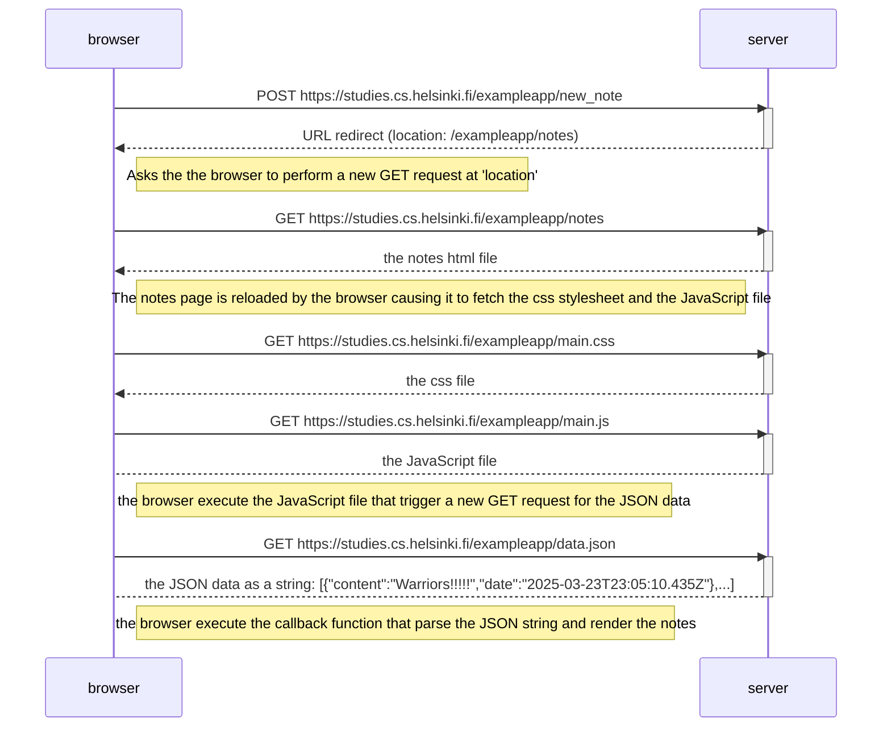

```mermaid
sequenceDiagram
    participant browser
    participant server

    browser->>server: POST https://studies.cs.helsinki.fi/exampleapp/new_note
    activate server
    server-->>browser: URL redirect (location: /exampleapp/notes)
    deactivate server   
    Note right of browser: Asks the the browser to perform a new GET request at 'location'
    
    browser->>server: GET https://studies.cs.helsinki.fi/exampleapp/notes
    activate server
    server-->>browser: the notes html file
    deactivate server
    Note right of browser: The notes page is reloaded by the browser causing it to fetch the css stylesheet and the JavaScript file

    browser->>server: GET https://studies.cs.helsinki.fi/exampleapp/main.css
    activate server
    server-->>browser: the css file
    deactivate server

    browser->>server: GET https://studies.cs.helsinki.fi/exampleapp/main.js
    activate server
    server-->browser: the JavaScript file
    deactivate server
    Note right of browser: the browser execute the JavaScript file that trigger a new GET request for the JSON data

    browser->>server: GET https://studies.cs.helsinki.fi/exampleapp/data.json
    activate server
    server-->browser: the JSON data as a string: [{"content":"Warriors!!!!!","date":"2025-03-23T23:05:10.435Z"},...]
    deactivate server
    Note right of browser: the browser execute the callback function that parse the JSON string and render the notes
```
