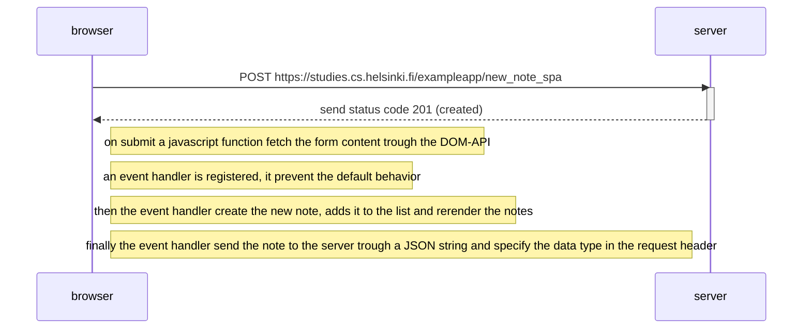

```mermaid
sequenceDiagram
    participant browser
    participant server

    browser->>server: POST https://studies.cs.helsinki.fi/exampleapp/new_note_spa
    activate server
    server-->>browser: send status code 201 (created)
    deactivate server   
    Note right of browser: on submit a javascript function fetch the form content trough the DOM-API
    Note right of browser: an event handler is registered, it prevent the default behavior
    Note right of browser: then the event handler create the new note, adds it to the list and rerender the notes
    Note right of browser: finally the event handler send the note to the server trough a JSON string and specify the data type in the request header
```
